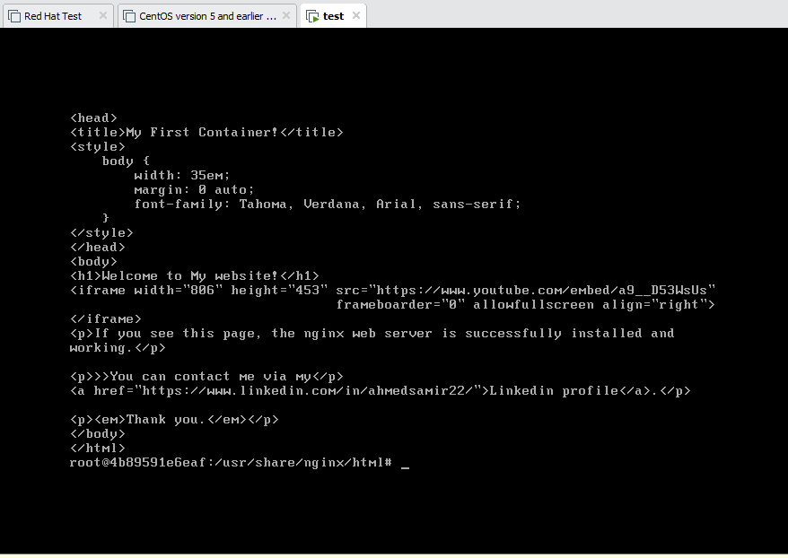
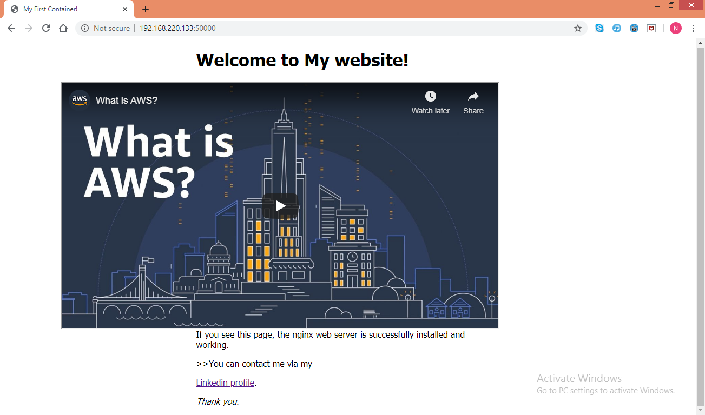

# My First Containerized Website
 
##  Project Overview

The purpose of this project was to learn the basics of container and how to use docker commands by hosting website on NGINX container.

## Steps to host website on NGINX container:
1- Download CoreOS.


2- create VM using the downloaded CoreOS ISO image.


3- Pull NGINX container from docker by using the following command:
```
docker pull nginx 
```


4- To run nginx image use the following command:
```
docker run -d -p 50000:80 nginx.
```

5- To get container ID use the following command:
```
docker ps
```
6- To reach index.html file inside the container use the following command:
```
docker exec -it container-ID /bin/bash
cd usr/share/nginx/html
```
7-  To write your code in index.html use the use the following command::
```
vim index.html
```
8- After editing index.html, Now save the container to be new image by using the following command:
```
Docker commit container-ID
```
##  Preview
# [To pull my docker image](https://hub.docker.com/repository/registry-1.docker.io/samir2296/containerization/tags?page=1)


